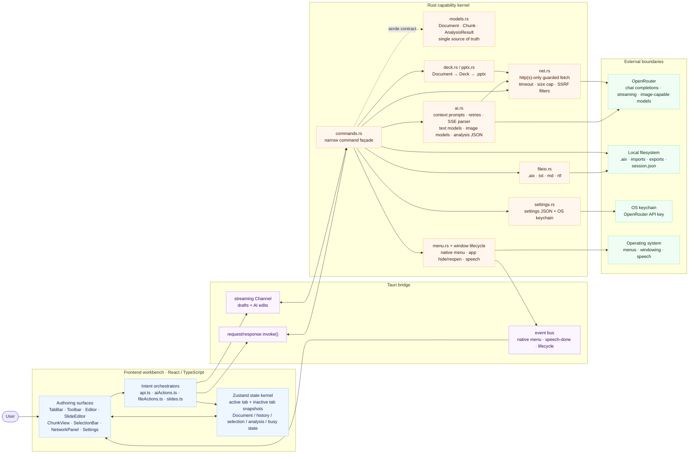

<div align="center">

<br/>


<br/>

# NurumayuEditor

<h3>
  <em>Write it. Share it this week. One file.</em>
</h3>

<br/>

[](https://github.com/kumeS/NurumayuFacet/releases)
&nbsp;
[](LICENSE)
&nbsp;
[](https://github.com/kumeS/NurumayuFacet/releases)

[](https://v2.tauri.app)
&nbsp;
[](https://www.rust-lang.org)
&nbsp;
[](https://react.dev)
&nbsp;
[](https://www.typescriptlang.org)

<br/>

---

<h2>Write Markdown. Preview it. Present it.</h2>

<em>One source. Two facets — the page and the stage.</em>

---

</div>

<br/>

<div align="center">
<table>
<tr>
<td align="center" width="33%">
<h3>🪄 One file, two faces</h3>
<p>Write a document — it's <strong>already a deck</strong>.<br/>The same chunks are your page and your slides.</p>
</td>
<td align="center" width="33%">
<h3>🧠 AI that knows every chunk</h3>
<p>Per-paragraph AI with full-document<br/>context — <strong>translate, proofread, expand, draft</strong>.</p>
</td>
<td align="center" width="33%">
<h3>📚 Grounded in your own library</h3>
<p>Drop in your own figures, and let AI<br/>draw on your <strong>accumulating personal library</strong> of confirmed notes and papers.</p>
</td>
</tr>
</table>
</div>

<br/>

> ### ✨ What is NurumayuEditor?
>
> **NurumayuEditor is a local-first Markdown, document, and slide editor.**
>
> Every paragraph lives as an independent **chunk** — think Jupyter Notebook cells, but for writing. One ordered list of chunks is projected two ways: as a **document** you edit, and as a **slide deck** you present. Change the writing, and the slides follow — same file, no export step, no second tool.
>
> Each chunk is also a self-contained unit for AI: **translate · proofread · summarize · expand · generate diagrams · generate images** — grounded in your own inserted figures and your growing personal library of confirmed notes and papers, all with full awareness of the surrounding context.
>
> _A scratchpad for rough weekly progress — not a finishing tool. Polish and formal presentation still happen in your usual external apps._

<br/>

## 📸 See it in action

### 1. The writing canvas

<div align="center">
  
</div>

> **A distraction-free writing canvas.** Use the paragraph editor for focused writing, the Markdown workspace for exact source plus live GFM preview, and Slides for presenting the same content. The toolbar keeps the essentials one click away (**Open / Save**, **Import / Export**, **Undo / Redo**, **Draft by AI**, **Review**, **Editor / Markdown / Slides**, **Help**).

**Quick start**

1. Launch the app — a fresh **Untitled Document** opens automatically.
2. Click the title to rename it, or just start typing in the first paragraph.
3. Press **➕ Add paragraph** (or `⌘/Ctrl+Shift+Enter` to split at the caret) to grow the document chunk by chunk. Begin a line with `# `, `## ` or `### ` to turn it into a heading.
4. Flip to **Slides** any time (toolbar toggle) — the same chunks become a deck. Need another document? Open a new tab with the tab-bar **＋** or `⌘/Ctrl+T` — each tab keeps its own file, history and analysis.

<br/>

### 2. Draft → refine → review (the core workflow)

<div align="center">
  
</div>

> **From a one-line theme to a polished draft — then sharpen it paragraph by paragraph.** The clip walks through the whole loop: generate a structured first draft, then use the per-chunk **✨** menu to revise, with every AI edit shown as a reviewable diff you can keep or undo.

**Tutorial — follow along**

1. **Draft the whole document.** Click **Draft by AI**, type a theme (here, _“BTC trend”_), pick an approximate length, and optionally attach reference text, a file (`.txt/.md/.rtf/.pdf`) or a URL. Hit **Draft** and the AI **streams** a structured first draft — headings + paragraphs — into a new tab (_“Draft created — 8 chunks”_).
2. **Refine paragraph by paragraph.** Focus any paragraph and open the **✨** menu in the left gutter: **Translate**, **Proofread**, **Revise with context**, **Expand**, **Add detail**, **Concentrate**, **Focus**, **Summarize**, **Bulletize**, **Generate diagram**, or a **Custom instruction**. Each action reads the surrounding chunks so the result stays coherent.
3. **Review the change.** Edits appear as an inline **diff** (_What changed vs previous_) — strikethrough for removals, highlight for additions. Keep it, hit **Revert**, or undo with `⌘/Ctrl+Z`.
4. **Iterate** across chunks until it reads the way you want, then **Save** as `.aix` (lossless), flip to **Slides** to present, or **Export** to `.txt/.md/.rtf/.pdf/.pptx`.

> 💡 **Tip:** `⌘/Ctrl+Enter` runs a quick **Proofread** on the focused paragraph — the fastest way to tidy a single chunk.

<br/>

### 3. Built-in guide (multilingual)

<div align="center">
  
</div>

> **Help is always one click away.** The **Help** button (toolbar or native Help menu) opens a step-by-step guide to the recommended workflow, plus a one-time **API-key setup** walkthrough. The guide is available in **five languages — English, 日本語, 中文, Español, Français** — chosen from the selector beside the title, and it follows your **Default language** in Settings automatically.

**Before your first AI action**

1. Create a free key at **[openrouter.ai](https://openrouter.ai/keys)** (sign in → **Keys** → **Create Key**).
2. Open **Settings** (gear icon, or `⌘/Ctrl+,`) and paste it under **OpenRouter API key** — it’s stored in the **macOS keychain**, never on disk in plaintext.
3. _(Optional)_ Choose your text / image models and **Default language**. Prefer a local **Ollama** endpoint? Leave the key blank.

<br/>

## Features

| Area | What it does |
| --- | --- |
| **Markdown edit + preview** | Open `.md`/`.markdown` files directly, edit their exact source in CodeMirror, and switch between **Edit**, **Preview**, or side-by-side **Split**. GFM tables, task lists, links, code blocks, images, and Mermaid fences render in the preview. `⌘/Ctrl+S` writes back to the opened Markdown file without reformatting its source. |
| **Document ⟷ Slides** | One document, two faces. The same chunks render as an editable **document** and as a **slide deck** — flip with the toolbar toggle; switching preserves your place and loses nothing. Slides are a projection of the writing, not a separate file. |
| **Multiple tabs** | Open and edit several documents at once. New tab via the tab-bar **＋** or `⌘/Ctrl+T`; each tab keeps its own document, file path, undo/redo history and analysis. |
| **Chunk editing** | Document = an ordered list of chunks. Split (`⌘/Ctrl+Shift+Enter`), merge (Backspace at start, or select 2+ adjacent paragraphs → **Merge**), reorder (↑/↓), add/delete, and move between chunks with the Up/Down arrows. |
| **Chunk types** | **Text**, **Heading** (`#`/`##`/`###`, levels 1–3), **Diagram** (Mermaid), and **Image**. Type `# `/`## `/`### ` at the start of a paragraph to turn it into a heading. |
| **Context-aware AI** | Every action sees the section heading, the neighboring paragraphs, and a whole-document map. Paragraph summaries are hash-checked and **auto-refreshed before each run** when their text changed, so the AI's understanding tracks the live document (not the last button press). |
| **Per-chunk AI menu (✨)** | **Translate** (choose language), **Proofread** (choose a style: Academic / Formal / Concise / Plain / Persuasive / custom), **Expand**, **Add detail**, **Concentrate**, **Focus**, **Summarize**, **Bulletize** (rewrite as bullet points, in place), **Generate diagram**, **Custom instruction**. `⌘/Ctrl+Enter` runs Proofread. |
| **Draft (streaming)** | Generate a full structured first draft from a theme; it **streams into a new tab in real time**, split into heading + paragraph chunks. |
| **Diagrams** | The model emits **Mermaid** code, rendered inline as SVG; diagram chunks keep an editable code area. |
| **Image generation** | Generate an image from a single paragraph (right-gutter button), or select multiple paragraphs (checkbox → floating **Generate image**) to combine them. Images are inserted as **image chunks** and can be reordered. Uses a separate image model (see Settings). |
| **Your own figures** | Insert your own images — file picker (command palette → *Insert image from file…*), drag-and-drop onto the editor, or paste from the clipboard. They land as ordinary **image chunks**, reorderable alongside AI-generated ones, with no round-trip through a model. |
| **Personal library (RAG)** | An on-device, growing corpus of your own confirmed notes and papers. Mark a chunk **confirmed** to make it eligible; embeddings and search run **entirely locally** (no network call beyond a one-time model download). AI actions ground their answer in the top matches from your library, and the sources used are surfaced back to you — open it from the command palette (*Open personal library (RAG)*). |
| **Relationship graph** _(optional)_ | **Analyze** builds a two-level network — **paragraph** nodes plus per-**sentence** nodes — with typed relations (cause, evidence, elaboration, contrast, …), drawn with **Cytoscape** (sentences nested under their paragraph). Click a node to jump to its paragraph; click an edge to flash both endpoints. Relations are color-coded with a legend, and the panel shows when the analysis ran. The graph is saved inside the `.aix` file. An occasional-use tool, not part of the core weekly loop — reachable from the command palette or the toolbar's quiet secondary cluster. |
| **Open / Import / Export** | Open and save `.md`/`.markdown` directly, or use the native `.aix` format to preserve chunks, metadata, comments, and analysis. Import `.txt`/`.md`/`.rtf`; export `.txt`, `.md`, `.rtf`, `.pdf`, and `.pptx`. All disk I/O and atomic writes stay in Rust. |
| **Native menu** | The macOS/Windows menu bar (File / Edit / AI / Window) mirrors the in-app toolbar; its custom items drive the same actions. |
| **Security** | The API key is stored in the **OS keychain** (macOS Keychain / Windows Credential Manager / Linux Secret Service) — never written to disk in plaintext, never sent to the frontend. All network calls happen in Rust. |
| **Resilience** | Free models are rate-limited; API calls retry on HTTP 429 / transient 5xx with exponential backoff, and surface actionable errors. |
| **Review comments** | Per-paragraph comments in a right-docked panel (add/edit/resolve/delete, persisted in `.aix`). **AI review** writes targeted comments; **Map logic** _(optional)_ uses the relationship graph to surface the model's opinion on possibly-unsupported claims and contradictions — not a verified audit. |
| **Read aloud** | Read one paragraph, a selection, or the whole document from the cursor (toolbar **Read/Stop**); the voice follows your default output language. macOS `say`-based. |
| **Command palette** | `⌘/Ctrl+K` — search and run every major action (export, analyze, review, read aloud, tabs, settings…). |
| **Health bar** | A persistent status strip: save state, word count, AI freshness, stale-summary count, and the last export's warnings (kept reviewable, not just a toast). |
| **Editor font** | Serif / Sans / Mono and 12–28px body size (Settings → Editor font). |
| **Slides** | Slide mode with 5 layouts (auto or manual, incl. **AI layout** suggestion), multi-image grids (up to 6 per slide, preview = export), placeholder slots, split/merge slides, overflow badges, and PPTX export with a warning report. |
| **Performance** | Per-chunk selectors (only the edited paragraph re-renders), async ops with loading indicators, lazy-loaded Mermaid/Cytoscape. |

## Settings

Open with the gear icon or `⌘/Ctrl+,`:

- **OpenRouter API key** — stored in the OS keychain.
- **Endpoint URL** — any OpenAI-compatible chat-completions endpoint.
- **Model (text)** — a managed list you can select from / add to / remove. Used
  for writing, proofreading, drafting and analysis.
- **Model (image generation)** — a separate managed list for image models
  (e.g. Google "Nano Banana"). **Verify exact model ids on
  openrouter.ai/models** — image-model ids change frequently and the seeded ones
  are starting points.
- **Default translation language** — picked from a dropdown (English, 日本語,
  中文, 한국어, Español, Français, …).
- **Temperature**.

## Keyboard shortcuts

| Shortcut | Action |
| --- | --- |
| `↑` / `↓` (at a paragraph's top/bottom line) | Move to the previous / next chunk |
| `⌘/Ctrl + Enter` | Proofread the focused paragraph |
| `⌘/Ctrl + Shift + Enter` | Split paragraph at the caret |
| `Backspace` (at start) | Merge with previous paragraph (empty heading → text) |
| `⌘/Ctrl + T` | New tab |
| `⌘/Ctrl + S` / `O` | Save / Open `.aix` or Markdown document |
| `⌘/Ctrl + Z` / `Shift+Z` | Undo / Redo |
| `⌘/Ctrl + ,` | Settings |
| `⌘/Ctrl + K` | Command palette |

## Architecture

### 🔀 High-level data flow

NurumayuEditor is deliberately split into a **stateful authoring workbench** in
React and a **capability boundary** in Rust. The frontend decides _what the user is
doing_; the backend owns everything that touches the outside world — files, the
network, the OS keychain, native menus and speech.

The central contract is the typed document model:

> `Document` → ordered `Chunk[]` → text / heading / diagram / image chunks, plus
> persisted analysis graph metadata.

That model is defined in Rust (`models.rs`), mirrored in TypeScript (`types.ts`),
and passed over Tauri IPC with `serde`/camelCase intact.



**Reading the flow**

- **The store is the workbench brain.** The active tab is kept in live top-level
  fields, while inactive tabs are stored as snapshots. Chunk edits, selection,
  undo/redo, analysis and busy state all converge in `store.ts`.
- **IPC is intentionally narrow.** The frontend sends intent (`draft`,
  `proofread`, `generate image`, `export pptx`, `save .aix`); Rust owns the
  side effects. API keys never cross into React.
- **Streaming is first-class.** Draft generation and long AI edits return
  incremental `Document` snapshots over a Tauri `Channel`, so chunks appear in
  place instead of waiting for a full response.
- **AI has two output paths.** Text/analysis/diagram actions return structured
  text or JSON; image actions extract a generated image URL/data payload and
  insert it as an image chunk.
- **Files are format adapters, not the source of truth.** `.aix` is the lossless
  document format. `.txt`, `.md`, `.rtf`, `.pdf` and `.pptx` are exports/imports
  derived from the chunk graph.
- **Remote input is filtered.** Reference URLs and remote image/document fetches
  go through `net.rs`, which restricts schemes, hosts, response size and timeout
  before data reaches AI prompts or PPTX generation.
- **Native shell integration is event-driven.** Menu clicks, macOS hide/reopen
  behavior and speech completion flow through Rust and then back to the same
  frontend actions used by the toolbar.

### Project layout

```
src/                     React frontend
  types.ts               TS mirror of the Rust model (camelCase)
  api.ts                 Typed invoke() wrappers (+ streaming Channel)
  store.ts               Zustand store: tabs, chunks, undo/redo, selection,
                         comments, speech queue, autosave
  aiActions.ts           AI orchestration (context freshness, review/integrity,
                         busy state, tab-race guards, read-aloud)
  fileActions.ts         New/Open/Import/Export/Draft/PPTX (dialog → Rust I/O)
  slides.ts              Deck derivation (mirrors deck.rs) for the Slide view
  mermaidRender.ts       Shared Mermaid loader + validate + offscreen SVG/PNG
  fonts.ts               Editor font stacks (Settings → Editor font)
  confirm.ts             Shared unsaved-changes dialog (quit / close tab)
  caret.ts               Visual-line caret detection (chunk Up/Down navigation)
  useShortcuts.ts        Global keyboard shortcuts (⌘K palette, ⌘W close tab…)
  components/            TabBar, Toolbar, Editor, SlideEditor, ChunkView,
                         ChunkAiMenu, MermaidChunk, NetworkPanel, ReviewPanel,
                         CommandPalette, HealthBar, SettingsModal, PromptModal,
                         SelectionBar, Toasts, ErrorBoundary, icons
src-tauri/src/           Rust backend
  lib.rs                 Tauri builder: commands, native menu, window lifecycle
  models.rs              Document / Chunk / ChunkMetadata / Analysis* (serde)
  commands.rs            Tauri command surface
  ai.rs                  LlmProvider trait + OpenRouter impl (SSE streaming,
                         image generation, retries) + prompts
  deck.rs + pptx.rs      Document → Deck → hand-written .pptx (OOXML,
                         multi-image grids, diagram snapshots)
  fileio.rs              txt/md/rtf import-export (RTF picture embedding),
                         paragraph + heading chunking, atomic writes
  pdf.rs                 Headless PDF export (system-font discovery, CJK-aware)
  imageio.rs             Shared image decode/size/fetch (pptx + rtf)
  net.rs                 SSRF-guarded, size-capped remote fetch
  settings.rs            Settings JSON + OS keychain (keyring), locale detection
  menu.rs                Native application menu (emits events to the frontend)
  cli.rs                 Headless CLI (capabilities / info / show / export)
  error.rs               Unified AppError
```

The AI layer is expressed as a trait (`LlmProvider`) so other OpenAI-compatible
providers can be slotted in without touching the command layer. State is managed
with **Zustand** for fine-grained per-chunk selector subscriptions; the active
tab lives in the top-level store fields while inactive tabs are kept as
snapshots, so existing chunk actions operate unchanged.

## Getting started

### Install (recommended) — Homebrew

```bash
brew tap kumeS/tap https://github.com/kumeS/NurumayuFacet   # one-time: the formula lives in this repo
brew install kumeS/tap/nurumayufacet
```

> The `brew tap … <url>` line is required because the formula ships inside the app's
> own repo rather than a separate `homebrew-tap` repo. (If you later create a
> `kumeS/homebrew-tap` repo containing the formula, `brew install
> kumeS/tap/nurumayufacet` works on its own, with no `brew tap` step.)

This **builds NurumayuEditor from source on your Mac**, so there is no notarization
/ *"app is damaged"* Gatekeeper prompt, and the binary matches your own CPU (Apple
Silicon or Intel). Homebrew installs Node and Rust automatically (Xcode Command
Line Tools required); the first build takes a few minutes.

Launch it from Spotlight as **NurumayuEditor**, or:

```bash
nurumayueditor                                           # CLI launcher
# …or add it to /Applications:
ln -sfn "$(brew --prefix)/opt/nurumayufacet/NurumayuEditor.app" /Applications/
```

The same binary is a headless CLI for agents and scripts:

```bash
nurumayueditor capabilities                 # machine-readable self-description (JSON)
nurumayueditor info document.aix [--json]   # structure; --json includes full chunk content
nurumayueditor show document.aix <chunkId>  # one chunk's raw content (diagram source, text…)
nurumayueditor export document.aix out.pdf  # txt / md / rtf / pdf / pptx
```

On first run, open **Settings** (gear icon, or `⌘/Ctrl+,`) and paste your
OpenRouter API key (free key at https://openrouter.ai/keys). The default text model
is free; change it (and the image model) to any id from
https://openrouter.ai/models. The key is stored in the macOS keychain, never on
disk in plaintext.

> **Prebuilt `.dmg` alternative.** A `.dmg` is also published on the
> [Releases](https://github.com/kumeS/NurumayuFacet/releases) page (and via the
> Homebrew **cask** [`Casks/nurumayufacet.rb`](Casks/nurumayufacet.rb)). That
> build is *not notarized*, so macOS quarantines it on download — after installing,
> clear the flag once with
> `xattr -dr com.apple.quarantine "/Applications/NurumayuEditor.app"`. The
> source build above avoids this entirely.

### Building from source manually (optional)

```bash
npm install
npm run tauri build    # → .app / .dmg under src-tauri/target/release/bundle/
```

## Notes & limitations

- AI features require an OpenRouter API key; image generation additionally
  requires an **image-capable** model id (verify on openrouter.ai/models).
- Free OpenRouter models share tight rate limits — if you hit 429 repeatedly,
  switch models in Settings, wait a minute, or add OpenRouter credit.
- `.rtf` conversion is pragmatic (text + paragraph structure), not full
  rich-text fidelity. `\'hh` byte escapes are decoded through Windows-1252, so
  smart quotes / dashes / bullets from Word-exported `.rtf` survive import.
- **Markdown source opened in the Markdown workspace is kept verbatim** and
  saves back without syntax rewriting. The native `.aix` format remains the
  lossless format for chunk-only metadata such as comments, slide layouts, and
  analysis. Other flat conversions (`.txt`/`.rtf`) are inherently lossy: a blank line
  inside one paragraph chunk is indistinguishable from a chunk break on
  re-import. `.txt` exports images/diagrams as placeholders by design; `.rtf`
  embeds PNG/JPEG images and diagram snapshots (GIF/BMP stay placeholders);
  Markdown keeps editable ` ```mermaid ` fences and round-trips headings,
  promoting a leading `# Heading` back to the document title.
- Diagram snapshots in RTF/PPTX are rendered by the app at export time — CLI
  exports can't render Mermaid headlessly and will say so in a warning.
- CLI PDF export needs a Unicode TTF font on the system (it looks for Arial
  Unicode and common Noto/DejaVu paths); the GUI's PDF export uses the OS
  print dialog and is unaffected.
- Canceling an in-flight AI action stops it from changing the document, but the
  HTTP request itself isn't aborted server-side (planned for v2.x).

## About the name

**NurumayuEditor** is the application name. It brings exact-source Markdown
editing, document-oriented chunk tools, and slide presentation into one local
workspace.

The native document format keeps the **`.aix`** extension, and the internal
bundle identifier (`com.aix.texteditor`) is unchanged, so documents and saved
settings from earlier versions keep working unchanged.

## License

Copyright (c) 2026 Satoshi Kume. Released under the **Artistic License 2.0** —
see [LICENSE](LICENSE).
