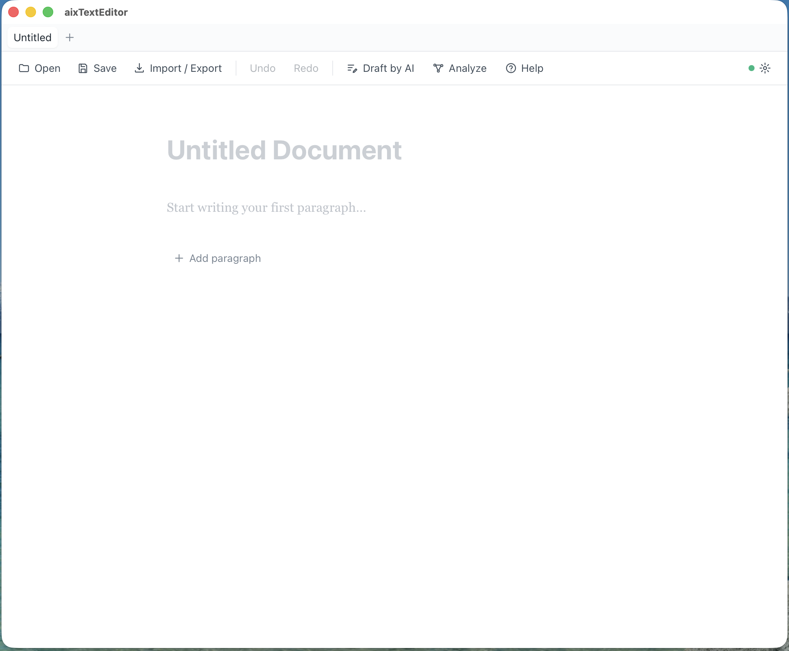
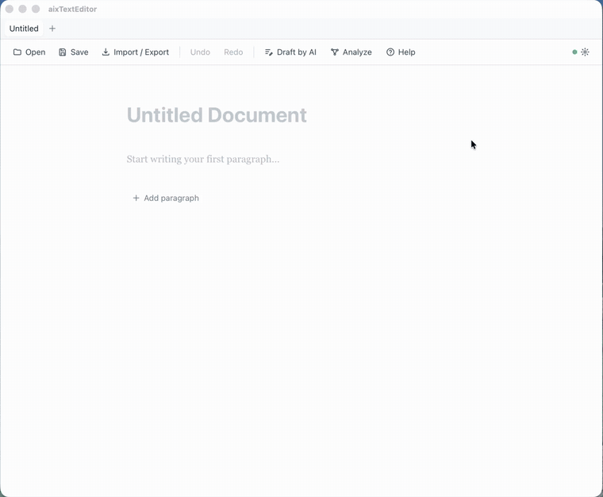
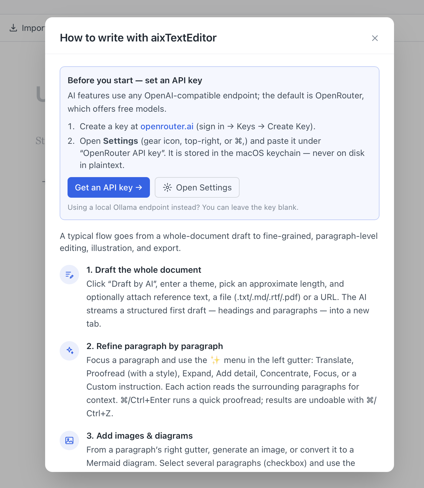
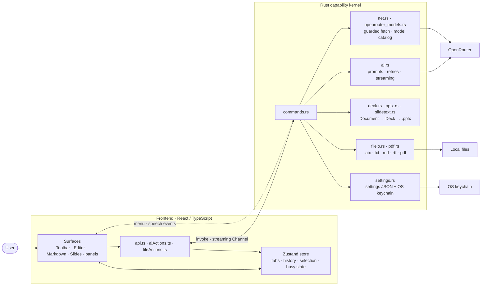

<div align="center">

<br/>


<br/>

# NurumayuEditor

<h3>
  <em>Write it. Share it this week. One file.</em>
</h3>

<br/>

[](https://github.com/kumeS/NurumayuEditor/releases)
&nbsp;
[](LICENSE)
&nbsp;
[](https://github.com/kumeS/NurumayuEditor/releases)

[](https://v2.tauri.app)
&nbsp;
[](https://www.rust-lang.org)
&nbsp;
[](https://react.dev)
&nbsp;
[](https://www.typescriptlang.org)

<br/>

---

<h2>Write Markdown. Preview it. Present it.</h2>

<em>One source. Two facets — the page and the stage.</em>

---

</div>

<br/>

<div align="center">
<table>
<tr>
<td align="center" width="33%">
<h3>🪄 One file, two faces</h3>
<p>Write a document — it's <strong>already a deck</strong>.<br/>The same chunks are your page and your slides.</p>
</td>
<td align="center" width="33%">
<h3>🧠 AI that knows every chunk</h3>
<p>Per-paragraph AI with full-document<br/>context — <strong>translate, proofread, expand, draft</strong>.</p>
</td>
<td align="center" width="33%">
<h3>📚 Grounded in your own library</h3>
<p>Drop in your own figures, and let AI<br/>draw on your <strong>accumulating personal library</strong> of confirmed notes and papers.</p>
</td>
</tr>
</table>
</div>

<br/>

> ### ✨ What is NurumayuEditor?
>
> **NurumayuEditor is a local-first Markdown, document, and slide editor.**
>
> Every paragraph lives as an independent **chunk** — think Jupyter Notebook cells, but for writing. One ordered list of chunks is projected two ways: as a **document** you edit, and as a **slide deck** you present. Change the writing, and the slides follow — same file, no export step, no second tool.
>
> Each chunk is also a self-contained unit for AI: **translate · proofread · summarize · expand · generate diagrams · generate images** — grounded in your own inserted figures and your growing personal library of confirmed notes and papers, all with full awareness of the surrounding context.
>
> _A scratchpad for rough weekly progress — not a finishing tool. Polish and formal presentation still happen in your usual external apps._

<br/>

## 🆕 What's new in v1.4.0

Released 2026-10-02. Full details, **Known Issues** and **Future Release** lists: [release notes (English)](release-notes/v1.4.0.en.md) · [リリースノート（日本語）](release-notes/v1.4.0.md) · [CHANGELOG](CHANGELOG.md).

- **Find & Replace** — a docked find bar in the paragraph editor and in Markdown source (`⌘F`, `⌥⌘F`, `⌘G` / `⇧⌘G`, `⌘L` Go to Line), with Replace All as one undo step.
- **OpenRouter model catalog** — browse the current model list in Settings, search it, show free models only, compare prices, and pick text and image models.
- **Direct PDF export** — Export as PDF opens a save dialog and writes the file; anything left out is counted in the health bar.
- **Safer tabs** — unsaved changes now offer **Save / Don't Save / Cancel**, the last tab can be closed, and **Save As…** is in the toolbar, the palette and on `⇧⌘S`.
- **Data integrity** — AI results land only in the document and paragraph they were requested for; switching Markdown / Editor / Slides never rewrites or dirties the Markdown source.
- **Slides** — bold, links, lists and code blocks render as formatting in the preview, Presentation mode and PPTX; speaker notes work on the title slide; PPTX embeds images stored next to the document.
- **Keyboard & accessibility** — dialogs close with `Esc` and keep focus inside; undo in text fields undoes the field.
- **Japanese UI** — the remaining English strings, AI errors and export warnings are translated; Japanese length is counted in characters.

<br/>

## 📸 See it in action

### 1. The writing canvas

<div align="center">
  
</div>

> **A distraction-free writing canvas.** Use the paragraph editor for focused writing, the Markdown workspace for exact source plus live GFM preview, and Slides for presenting the same content. A **files sidebar** docks on the left for browsing a project folder, and the toolbar keeps the essentials one click away (**Open** ▸ *File… / Folder…*, **Save** with a ▾ menu for **Save As…**, **Hide files / Show files**, **Import / Export**, **Undo / Redo**, **Draft by AI**, **Analyze**, **Review**, **Read**, **Editor / Markdown / Slides**, **Help**).

**Quick start**

1. Launch the app — a fresh **Untitled Document** opens automatically.
2. Click the title to rename it, or just start typing in the first paragraph.
3. Press **➕ Add paragraph** (or `⌘/Ctrl+Shift+Enter` to split at the caret) to grow the document chunk by chunk. Begin a line with `# `, `## ` or `### ` to turn it into a heading.
4. Flip to **Slides** any time (toolbar toggle) — the same chunks become a deck. Need another document? Open a new tab with the tab-bar **＋** or `⌘/Ctrl+T` — each tab keeps its own file, history and analysis.
5. Close a tab with its **✕** or `⌘/Ctrl+W`. If it has unsaved changes you can **Save**, **Don't Save** or **Cancel**; closing the last tab leaves a fresh empty document.

<br/>

### 2. Draft → refine → review (the core workflow)

<div align="center">
  
</div>

> **From a one-line theme to a polished draft — then sharpen it paragraph by paragraph.** The clip walks through the whole loop: generate a structured first draft, then use the per-chunk **✨** menu to revise, with every AI edit shown as a reviewable diff you can keep or undo.

**Tutorial — follow along**

1. **Draft the whole document.** Click **Draft by AI**, type a theme (here, _“BTC trend”_), pick an approximate length, and optionally attach reference text, a file (`.txt/.md/.rtf/.pdf`) or a URL. Hit **Draft**: as soon as the first content arrives a new tab opens and the AI **streams** a structured first draft — headings + paragraphs — into it. The finished draft reports its length against your target (_“Draft created — 8 paragraphs, ~812 words (target ~800).”_). If the request fails before any content arrives, the dialog stays open with your theme, length and references, ready to **Retry**.
2. **Refine paragraph by paragraph.** Focus any paragraph and open the **✨** menu in the left gutter (_Rewrite, translate or illustrate with AI…_): **Translate**, **Proofread**, **Revise with context**, **Expand**, **Add detail**, **Concentrate**, **Focus**, **Summarize**, **Bulletize**, **Generate diagram**, or a **Custom instruction**. Each action reads the surrounding chunks so the result stays coherent.
3. **Review the change.** Edits appear as an inline **diff** (_What changed vs previous_) — strikethrough for removals, highlight for additions. Keep it, hit **Revert**, or undo with `⌘/Ctrl+Z`.
4. **Iterate** across chunks until it reads the way you want, then **Save** as `.aix` (lossless), flip to **Slides** to present, or **Export** to `.txt/.md/.rtf/.pdf/.pptx`.

> 💡 **Tip:** `⌘/Ctrl+Enter` runs a quick **Proofread** on the focused paragraph — the fastest way to tidy a single chunk.

<br/>

### 3. Built-in guide (multilingual)

<div align="center">
  
</div>

> **Help is always one click away.** The **Help** button (toolbar or native Help menu) opens a step-by-step guide to the recommended workflow, plus a one-time **API-key setup** walkthrough. The guide is available in **five languages — English, 日本語, 中文, Español, Français** — chosen from the selector beside the title, and it follows your **Default language** in Settings automatically. The footer shows the version and build id (for example _Version 1.4.0 (abc1234)_), so a bug report can name the exact build.

**Before your first AI action**

1. Create a free key at **[openrouter.ai](https://openrouter.ai/keys)** (sign in → **Keys** → **Create Key**).
2. Open **Settings** (gear icon, or `⌘/Ctrl+,`) and paste it under **OpenRouter API key** — it’s stored in the **macOS keychain**, never on disk in plaintext.
3. _(Optional)_ Choose your text / image models and **Default language**. Once the endpoint and key are saved, **Browse OpenRouter models** loads the current catalog so you can search it, filter to free models and compare prices. Prefer a local **Ollama** endpoint? Leave the key blank and type the model id.

<br/>

## Features

| Area | What it does |
| --- | --- |
| **Markdown edit + preview** | Open `.md`/`.markdown` files directly, edit their exact source in CodeMirror, and switch between **Edit**, side-by-side **Split**, or **Preview** — which is what a Markdown document opens in. GFM tables, task lists, links, code blocks, images, and Mermaid fences render in the preview, and you can click rendered text to edit it in place. The preview has its own **zoom (60–250%)** — `⌘/Ctrl +`, `−`, `0`, or the toolbar `− 100% ＋` — which scales the whole page (measure, margins, tables, images), not just the type. `⌘/Ctrl+S` writes back to the opened Markdown file without reformatting its source. Switching between Markdown, Editor and Slides never rewrites the source: an unedited round trip is byte-for-byte identical, an edit made in the Editor changes only the paragraphs you touched, YAML frontmatter stays at the top as metadata, and CRLF files stay CRLF. |
| **Document ⟷ Slides** | One document, two faces. The same chunks render as an editable **document** and as a **slide deck** — flip with the toolbar toggle; switching is a view change only — it preserves your place, loses nothing and never marks the document unsaved. Slides are a projection of the writing, not a separate file. |
| **Files sidebar** | A left-docked **folder tree** for working out of a project folder: **Open ▸ Folder…** (`⌘/Ctrl+Shift+O`) picks a root, subfolders expand lazily, and clicking a `.aix`/`.md`/`.markdown` file opens it in a tab (other file types are listed but greyed out). Show/hide it from the section's own **Hide** button, the toolbar **Hide files / Show files** toggle, or the command palette. Directory listing stays in Rust, jailed to the chosen root. |
| **Multiple tabs** | Open and edit several documents at once. New tab via the tab-bar **＋** or `⌘/Ctrl+T`; each tab keeps its own document, file path, undo/redo history and analysis. Close a tab with its **✕**, `⌘/Ctrl+W`, **File ▸ Close Tab** or the palette; closing the last tab leaves a fresh empty document. A tab with unsaved changes asks **Save / Don't Save / Cancel** (a cancelled or failed save keeps the tab open), and quitting asks for each unsaved tab in turn. |
| **Chunk editing** | Document = an ordered list of chunks. Split (`⌘/Ctrl+Shift+Enter`), merge (Backspace at start, or select 2+ adjacent paragraphs → **Merge**), reorder (↑/↓), add/delete, and move between chunks with the Up/Down arrows. |
| **Chunk types** | **Text**, **Heading** (`#`/`##`/`###`, levels 1–3), **Diagram** (Mermaid), and **Image**. Type `# `/`## `/`### ` at the start of a paragraph to turn it into a heading. |
| **Context-aware AI** | Every action sees the section heading, the neighboring paragraphs, and a whole-document map. Paragraph summaries are hash-checked and **auto-refreshed before each run** when their text changed, so the AI's understanding tracks the live document (not the last button press). A result is applied only to the tab and document it was requested for, and only if the paragraph still holds the text that was sent; otherwise it is discarded and recorded in the **Recent AI operations** log in the network panel (ids only, never text or keys). |
| **Per-chunk AI menu (✨ _Rewrite, translate or illustrate with AI…_)** | **Translate** (choose language), **Proofread** (choose a style: Academic / Formal / Concise / Plain / Persuasive / custom), **Expand**, **Add detail**, **Concentrate**, **Focus**, **Summarize**, **Bulletize** (rewrite as bullet points, in place), **Generate diagram**, **Custom instruction**. `⌘/Ctrl+Enter` runs Proofread. |
| **Draft (streaming)** | Generate a full structured first draft from a theme. The tab opens when the first content arrives and the draft **streams in real time**, split into heading + paragraph chunks. Lengths are approximate — words for English, characters for Japanese, Chinese and Korean — and the result is reported against the target; a miss of more than ±20% stays in the health bar. A failed request keeps the dialog open with your inputs for **Retry**. |
| **Find & Replace** | `⌘/Ctrl+F` opens a docked find bar in the paragraph editor and in Markdown source; `⌘/Ctrl+Option/Alt+F` adds the replace row, `⌘/Ctrl+G` and `⌘/Ctrl+Shift+G` step forward and back through matches, and `⌘/Ctrl+L` jumps to a line in Markdown source. Case-sensitive and whole-word toggles, Japanese-aware matching, literal replacements, and **Replace All** undoes in one step. Also in **Edit** and the command palette. Not yet available in Slides. |
| **Diagrams** | The model emits **Mermaid** code, rendered inline as SVG; diagram chunks keep an editable code area. |
| **Image generation** | Generate an image from a single paragraph (right-gutter button), or select multiple paragraphs (checkbox → floating **Generate image**) to combine them. Images are inserted as **image chunks** and can be reordered. Uses a separate image model (see Settings). |
| **Your own figures** | Insert your own images — file picker (command palette → *Insert image from file…*), drag-and-drop onto the editor, or paste from the clipboard. They land as ordinary **image chunks**, reorderable alongside AI-generated ones, with no round-trip through a model. |
| **Personal library (RAG)** | An on-device, growing corpus of your own confirmed notes and papers. Mark a chunk **confirmed** to make it eligible; embeddings and search run **entirely locally** (no network call beyond a one-time model download). AI actions ground their answer in the top matches from your library, and the sources used are surfaced back to you — open it from the command palette (*Open personal library (RAG)*). |
| **Relationship graph** _(optional)_ | **Analyze** builds a two-level network — **paragraph** nodes plus per-**sentence** nodes — with typed relations (cause, evidence, elaboration, contrast, …), drawn with **Cytoscape** (sentences nested under their paragraph). Click a node to jump to its paragraph; click an edge to flash both endpoints. Relations are color-coded with a legend, and the panel shows when the analysis ran. The graph is saved inside the `.aix` file. An occasional-use tool, not part of the core weekly loop — reachable from the command palette or the toolbar's quiet secondary cluster. |
| **Open / Import / Export** | Open and save `.md`/`.markdown` directly, or use the native `.aix` format to preserve chunks, metadata, comments, and analysis. **Save As offers both formats for any document** — choosing `.md` for an Editor/Slide document converts it and reports, on the health bar, that view mode and slide-only details won't round-trip. **Save As…** is on the toolbar's **Save ▾** menu, in **File**, in the palette and on `⇧⌘S`. Import `.txt`/`.md`/`.rtf`; export `.txt`, `.md`, `.rtf`, `.pdf` (written directly through a save dialog), and `.pptx`. PPTX and RTF embed images stored next to the document. Anything an export leaves out (images, diagrams, formatting) is listed with counts in the health bar's export report. All disk I/O and atomic writes stay in Rust. |
| **Native menu** | The macOS/Windows menu bar (File / Edit / AI / Window / Help) mirrors the in-app toolbar — **File** includes **Save As…** and **Close Tab**, **Edit** includes **Find…**, **Find and Replace…**, **Find Next**, **Find Previous** and **Go to Line…**; its custom items drive the same actions, and its labels follow the interface language (rebuilt when you change it, so the menu bar never disagrees with the app). |
| **Interface language** | Setting **Default language** to 日本語 renders the whole app in Japanese — toolbar, panels, dialogs, command palette, toasts and the native menu bar — and back to English for any other choice. Untranslated strings fall back to English rather than disappearing, and two test guards fail the build if a new UI string is added without a translation. |
| **Model catalog** | Settings ▸ **Browse OpenRouter models**: once the endpoint and API key are saved, **Fetch OpenRouter models** loads the current list — search by name or id, **Free only** filter, prices and context length, and separate text and image pickers. Saved models missing from the catalog are marked, never deleted. Nothing is fetched until you press Fetch, and the key is sent only to openrouter.ai over HTTPS. |
| **Security** | The API key is stored in the **OS keychain** (macOS Keychain / Windows Credential Manager / Linux Secret Service) — never written to disk in plaintext, never sent to the frontend. All network calls happen in Rust. |
| **Resilience** | Free models are rate-limited; API calls retry on HTTP 429 / transient 5xx with exponential backoff, and surface actionable errors. A model the provider no longer serves (HTTP 404) is named in the message, and the health bar keeps a **Model unavailable: …** chip with **Open Settings** until you choose another model. Provider errors appear in Japanese when the interface is Japanese. |
| **Citations** | Bring your own references: import a `.bib` file, or look up a **DOI / arXiv id** to fetch metadata. Insert in-text citations and build a references list in **APA / IEEE / BibTeX-key** style. The library is a JSON sidecar next to the `.aix` file (so a document must be saved first). Not a literature-search engine. |
| **Review criteria** _(optional)_ | Check a draft against your own list of criteria (e.g. a call for proposals) and see which are covered, partially covered, or missing — each with the paragraph it rests on. Needs a fresh **Analyze** run. |
| **Presentation mode** | A window-filling overlay for the deck: arrow/space navigation, speaker notes toggle (`N`), `Esc` to exit. It renders the same `SlideStage` as the thumbnails and the PPTX export, so what you present is what you exported. |
| **Changes since last save** | The health bar shows how many paragraphs were added, removed or changed since the last save — or that only the title or other document data changed — and never says “no changes” while the document is unsaved; click it for a per-paragraph diff. |
| **Ghost text** _(on whenever AI is configured)_ | A faint inline continuation while you type (Tab to accept, Esc to dismiss). After you type and pause with the caret at the end of a paragraph, that paragraph's text and the nearest preceding heading are sent to the configured endpoint. Turn on **Limit ghost-text completion to a local model** in Settings to keep it on-device (nothing is sent to a remote model). |
| **Agent access (MCP)** | A minimal MCP server exposes documents to an external AI agent (e.g. Claude Desktop / Claude Code). Read and export are always available; **writing** a labeled reference chunk back into a document is off by default and enabled with one Settings toggle. |
| **Length warnings** | Set a per-paragraph character limit and the health bar flags every paragraph over it, with a jump list. CJK counts as one character each — useful for grant forms and abstracts. |
| **Review comments** | Per-paragraph comments in a right-docked panel (add/edit/resolve/delete, persisted in `.aix`). **AI review** writes targeted comments; **Map logic** _(optional)_ uses the relationship graph to surface the model's opinion on possibly-unsupported claims and contradictions — not a verified audit. |
| **Read aloud** | Read one paragraph, a selection, or the whole document from the cursor (toolbar **Read/Stop**); the voice follows your default output language. macOS `say`-based. |
| **Command palette** | `⌘/Ctrl+K` — search and run every major action (save as, find & replace, export, analyze, review, read aloud, tabs, slide commands, model catalog, settings…). |
| **Keyboard & dialogs** | Dialogs close with `Esc` (ignored while a Japanese IME is converting), keep keyboard focus inside until they close, and block the window behind them. `⌘/Ctrl+Z` in a text field such as the title or a dialog input undoes that field, not the document. |
| **Health bar** | A persistent status strip: save state, document length (characters for mostly Japanese text, words otherwise — the tooltip shows both), AI freshness, stale-summary count, a model-unavailable chip when needed, and the last export or draft report (kept reviewable, not just a toast). |
| **Editor font** | Serif / Sans / Mono and 12–28px body size (Settings → Editor font). |
| **Slides** | Slide mode with 5 layouts (auto or manual, incl. **AI layout** suggestion), multi-image grids (up to 6 per slide, preview = export), placeholder slots, split/merge slides, overflow badges, and PPTX export with a warning report. Slide bodies render Markdown formatting — bold, italics, links, inline code, bullet and numbered lists, code blocks and quotes — the same way in the preview, Presentation mode and PPTX. Speaker notes work on every slide, including the first slide made from the document title, and the slide commands are in the palette in Slides mode. |
| **Performance** | Per-chunk selectors (only the edited paragraph re-renders), async ops with loading indicators, lazy-loaded Mermaid/Cytoscape. |

## Settings

Open with the gear icon or `⌘/Ctrl+,`:

- **Default language** — the output language for every AI action; choosing 日本語 also switches the interface and the native menu to Japanese.
- **OpenRouter API key** — stored in the OS keychain and read only when an AI action needs it, so macOS doesn't ask for keychain access on every launch.
- **Endpoint URL** — any OpenAI-compatible chat-completions endpoint (for a local Ollama bridge, leave the key blank).
- **Model (text)** / **Model (image generation)** — managed lists you can select from, add to and remove. **Browse OpenRouter models** fetches the current catalog once the endpoint and key are saved; a model the provider no longer serves is marked. Image-model ids change often, so the seeded ones are starting points.
- **Limit ghost-text completion to a local model**, **Paragraph character-limit warning**, **Personal knowledge base (RAG)** and **Allow AI agent to write into documents (MCP)** — all off by default.
- **Editor font** (Serif / Sans / Mono, 12–28px), **Writing tone** and **Temperature**.

## Keyboard shortcuts

| Shortcut | Action |
| --- | --- |
| `↑` / `↓` (at a paragraph's top/bottom line) | Move to the previous / next chunk |
| `⌘/Ctrl + Enter` | Proofread the focused paragraph |
| `⌘/Ctrl + Shift + Enter` | Split paragraph at the caret |
| `Backspace` (at start) | Merge with previous paragraph (empty heading → text) |
| `⌘/Ctrl + T` | New tab |
| `⌘/Ctrl + W` | Close tab (the last tab becomes a fresh empty document) |
| `⌘/Ctrl + S` / `O` | Save / Open `.aix` or Markdown document |
| `⌘/Ctrl + Shift + S` | Save As… |
| `⌘/Ctrl + F` | Find |
| `⌘/Ctrl + Option/Alt + F` | Find and Replace |
| `⌘/Ctrl + G` / `Shift + G` | Find next / previous |
| `⌘/Ctrl + L` | Go to line (Markdown source) |
| `⌘/Ctrl + Shift + O` | Open a folder in the files sidebar |
| `⌘/Ctrl + +` / `−` / `0` | Markdown preview: zoom in / out / reset |
| `⌘/Ctrl + Z` / `Shift+Z` | Undo / Redo (in a text field, that field's own undo) |
| `Tab` / `Esc` | Accept / dismiss a ghost-text suggestion |
| `Esc` | Close a dialog or the find bar |
| `⌘/Ctrl + ,` | Settings |
| `⌘/Ctrl + K` | Command palette |

## Architecture

NurumayuEditor splits a **stateful authoring workbench** in React from a **capability boundary** in Rust: the frontend decides _what the user is doing_, and the backend owns everything that touches the outside world — files, the network, the OS keychain, native menus and speech. The central contract is the typed document model — `Document` → ordered `Chunk[]` (text / heading / diagram / image) plus persisted analysis metadata — defined in Rust (`models.rs`), mirrored in TypeScript (`types.ts`), and passed over Tauri IPC with `serde`/camelCase intact.



- **One store.** The active tab lives in top-level store fields and inactive tabs are snapshots; edits, selection, undo/redo, analysis and busy state converge in `store.ts`.
- **Narrow IPC.** The frontend sends intent (draft, proofread, export, save); Rust owns the side effects, and API keys never reach React. Drafts and long AI edits stream back as incremental `Document` snapshots over a Tauri `Channel`.
- **Results go to their owner.** Every AI operation records the tab and the document load it started in; a result for a closed, switched or reloaded document, or for a paragraph edited since the request, is discarded.
- **Markdown stays canonical.** `.aix` is the lossless format. For a Markdown-backed document the Markdown source is the canonical text, and chunk edits are merged back without touching other bytes. `.txt`, `.rtf`, `.pdf` and `.pptx` are exports.
- **Filtered network.** Reference URLs, remote images and the model catalog go through `net.rs` (scheme, host, size and timeout limits); the catalog sends the API key only to openrouter.ai over HTTPS.

### Project layout

```
release-notes/                    Release notes per version (Japanese + English)
src/                              React frontend
  types.ts · api.ts               TS mirror of the Rust model; typed invoke() wrappers
  store.ts                        Zustand store: tabs, chunks, undo/redo, selection, autosave
  aiActions.ts · fileActions.ts   AI orchestration; open / save / import / export / draft
  markdown.ts                     Document ⟷ Markdown; merge serializer keeps untouched bytes
  slides.ts · slideText.ts        Deck derivation and slide text runs (twins of deck.rs / slidetext.rs)
  findReplace.ts                  Find / replace / go-to-line core (CJK-aware)
  shortcuts.ts · modalBehavior.ts Shortcut resolver; Escape and focus-trap helpers
  textStats.ts · draftLength.ts   Length counting (characters vs words)
  aiErrors.ts · exportWarnings.ts Localized provider errors and Rust warnings
  i18n.ts                         UI language + English → Japanese dictionary
  components/                     Toolbar, TabBar, Editor, MarkdownEditor, SlideEditor,
                                  FindBar, Modal, panels, dialogs, HealthBar, …
src-tauri/src/                    Rust backend
  lib.rs · commands.rs            Tauri builder; command surface
  models.rs                       Document / Chunk / Analysis (serde)
  ai.rs                           OpenRouter provider: prompts, streaming, retries, images
  fileio.rs · pdf.rs              txt / md / rtf / pdf import-export, atomic writes
  deck.rs · pptx.rs · slidetext.rs Document → Deck → .pptx (notes, links, images)
  net.rs · openrouter_models.rs   Guarded fetch; model catalog
  rag.rs · citations.rs           On-device personal library; BibTeX / DOI / arXiv
  settings.rs · menu.rs           Settings + keychain; localized native menu
  cli.rs · mcp.rs                 Headless CLI; MCP server for agents
  imageio.rs · error.rs           Image decode and checks; unified AppError
```

## Getting started

### Install (recommended) — Homebrew

```bash
brew tap kumeS/tap https://github.com/kumeS/NurumayuEditor   # one-time: the formula lives in this repo
brew install kumeS/tap/nurumayueditor
```

This **builds NurumayuEditor from source on your Mac**, so there is no notarization / *"app is damaged"* Gatekeeper prompt, and the binary matches your CPU (Apple Silicon or Intel). Homebrew installs Node and Rust automatically (Xcode Command Line Tools required); the first build takes a few minutes. Launch it from Spotlight as **NurumayuEditor**, or with `nurumayueditor`; to add it to /Applications, run `ln -sfn "$(brew --prefix)/opt/nurumayueditor/NurumayuEditor.app" /Applications/`.

The same binary is a headless CLI for agents and scripts:

```bash
nurumayueditor capabilities                 # machine-readable self-description (JSON)
nurumayueditor info document.aix [--json]   # structure; --json includes full chunk content
nurumayueditor show document.aix <chunkId>  # one chunk's raw content (diagram source, text…)
nurumayueditor export document.aix out.pdf  # txt / md / rtf / pdf / pptx
nurumayueditor ai proofread document.aix <chunkId> [--json]  # one per-paragraph AI action
nurumayueditor mcp                          # MCP server over stdio for AI agents
```

On first run, open **Settings** and paste your OpenRouter API key (free key at https://openrouter.ai/keys); it is stored in the macOS keychain, never on disk in plaintext. The default text model is free; change it with **Browse OpenRouter models**, or type any id from https://openrouter.ai/models.

> **Prebuilt `.dmg` alternative.** A `.dmg` is also published on the [Releases](https://github.com/kumeS/NurumayuEditor/releases) page (and via the cask [`Casks/nurumayueditor.rb`](Casks/nurumayueditor.rb)). It is *not notarized*, so clear the quarantine flag once after installing: `xattr -dr com.apple.quarantine "/Applications/NurumayuEditor.app"`.

### Building from source and development

```bash
npm install
npm run tauri build                 # → .app / .dmg under src-tauri/target/release/bundle/
npm run install:app                 # build, then install into /Applications (old copy → Trash)
npm test                            # frontend unit tests (vitest)
npm run build                       # typecheck + production build
(cd src-tauri && cargo test --lib)  # backend tests
```

Every update bumps the version (in `package.json`, `src-tauri/tauri.conf.json` and `src-tauri/Cargo.toml`) and adds release notes in Japanese and English — see [release-notes/README.en.md](release-notes/README.en.md). `npm test` fails if the three versions disagree or the current version has no release notes.

## Notes & limitations

- The full **Known Issues** and **Future Release** lists for this version are in the release notes: [English](release-notes/v1.4.0.en.md) · [日本語](release-notes/v1.4.0.md). The most visible ones are below.
- Find & Replace is not yet available in Slides, and Go to Line works in Markdown source only.
- Speaker notes are saved in `.aix` only. A `.pptx` with speaker notes has no notes master, so some versions of PowerPoint may offer to repair it (Keynote opens it without a warning).
- Images a document points to are read with extension, size (25 MB) and content checks, and symbolic links are refused, but reads are not confined to the document's folder.
- AI features need an OpenRouter API key (or a local endpoint); image generation also needs an **image-capable** model. Free OpenRouter models share tight rate limits — if you hit 429 repeatedly, switch models, wait a minute, or add credit.
- Markdown source is kept verbatim and saves back without syntax rewriting; `.aix` remains the lossless format for chunk-only metadata (comments, slide layouts, analysis). `.txt`/`.rtf` are lossy: `.txt` writes images and diagrams as placeholders, and `.rtf` embeds PNG/JPEG images and diagram snapshots (GIF/BMP/WEBP stay placeholders). RTF import keeps text and paragraph structure, decoding `\'hh` escapes as Windows-1252.
- Diagram snapshots in RTF/PPTX are rendered by the app at export time — CLI exports can't render Mermaid headlessly and will say so in a warning.
- PDF export (GUI and CLI share one Rust renderer) writes a plain A4 text
  layout and needs a Unicode TTF font on the system (it looks for Arial
  Unicode and common Noto/DejaVu paths; none found → an error). Arial Unicode
  (macOS/Windows) covers CJK; the DejaVu Sans fallback on Linux does not, so
  CJK text prints as missing glyphs there. Images become `[Image: caption]` text placeholders, diagrams print
  as their Mermaid source, and when the document is in Markdown or Slide mode
  or is Markdown-backed (e.g. opened from a `.md` file), inline markup (`**`,
  links, list markers) prints literally; each is counted in the export report
  (health bar in the GUI, `warning:` lines in the CLI). In a plain Editor
  document that is not Markdown-backed, `**` is text you typed and prints as
  written, uncounted. Embedding images and
  rendered diagrams is planned.
- Canceling an in-flight AI action stops it from changing the document, but the HTTP request itself isn't aborted server-side (planned for v2.x).

## About the name

**NurumayuEditor** brings exact-source Markdown editing, document-oriented chunk tools, and slide presentation into one local workspace. The native document format keeps the **`.aix`** extension and the bundle identifier (`com.aix.texteditor`) is unchanged, so documents and settings from earlier versions keep working.

## License

Copyright (c) 2026 Satoshi Kume. Released under the **Artistic License 2.0** —
see [LICENSE](LICENSE).
